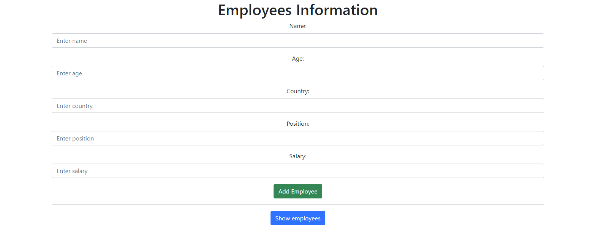
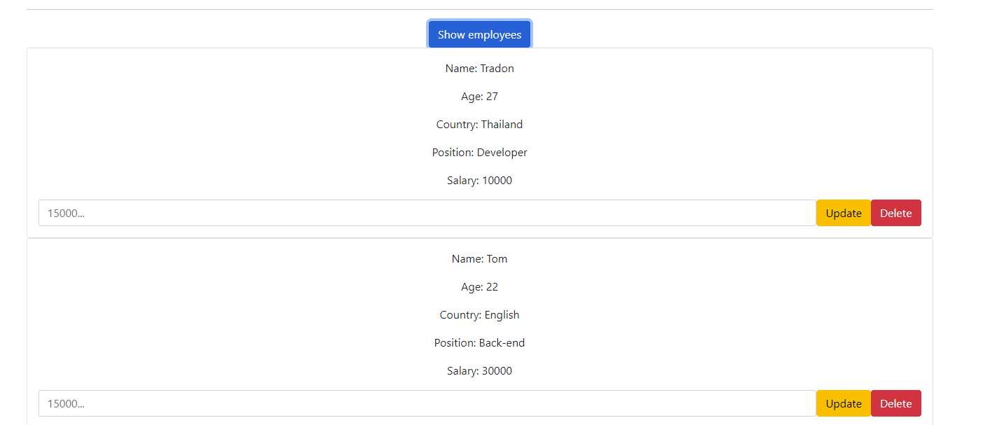
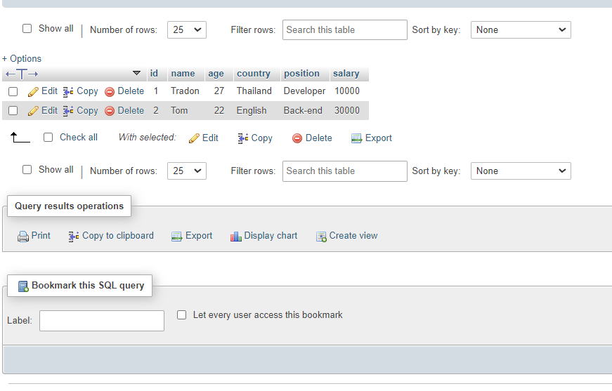
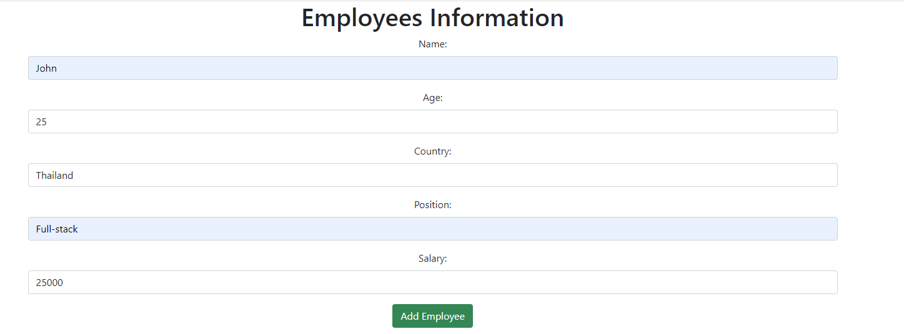
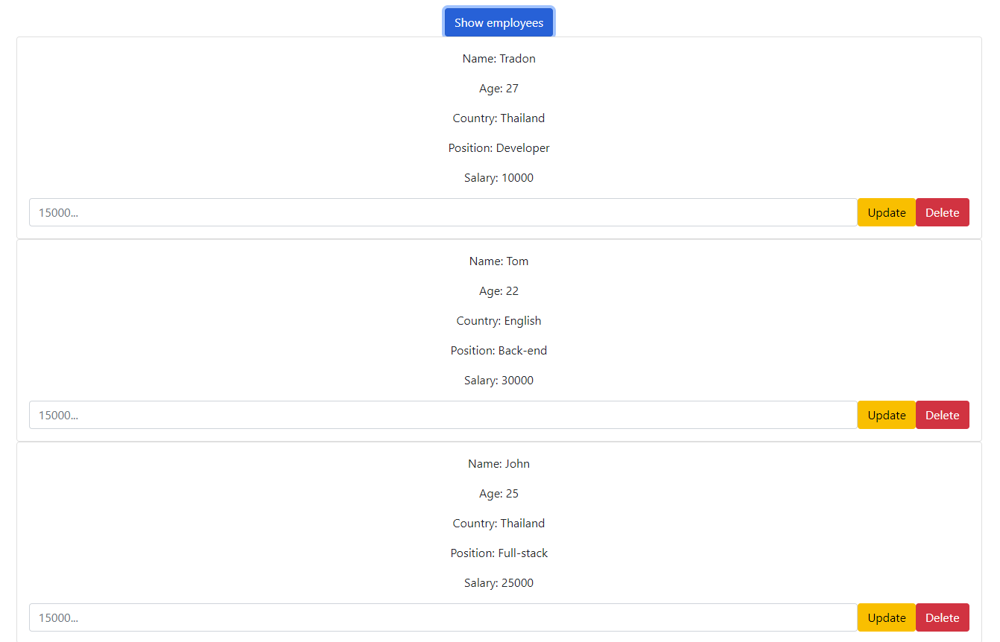
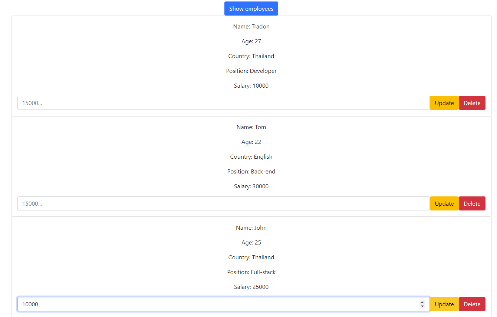
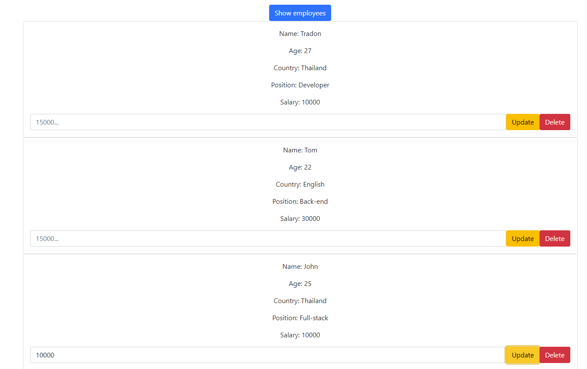
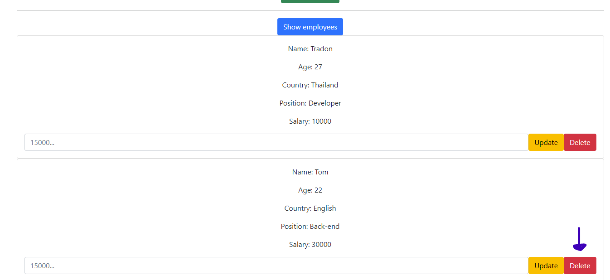

# Employees List
### By React and MySQL
### แสดงผลพนักงาน ตาม List รายชื่อในฐานข้อมูล MySQL
 

1. ทดสอบโปรแกรมด้วย **_npm start_**  (ภายใน project folder ผ่าน command prompt)

2. จำเป็นต้องใช้งานโปรแกรมจำลอง Server  
เลือกใช้ตามแต่สะดวก ข้อมูลอยู่ใน
**[Data](./data/)** ในที่นี้ใช้ **_MySQL_**

3. เมื่อ **_npm start_** แล้วจะได้หน้าจอดังนี้

4. สามารถ กด **_Show employees_** เพื่อเรียกดูข้อมูลจาก MySQL

5. สามารถ กรอกข้อมูลลงในแบบฟอร์ม แล้วกด **_Add Employee_** เพื่อเพิ่มรายชื่อลงในฐานข้อมูล MySQL

6. ข้อมูลจะปรากฎต่อลงไปด้านล่าง

7. สามารถ update ข้อมูล salary โดยการกรอกข้อมูลลงใน input แล้วกด **_Update_** 

8. สามารถลบข้อมูลที่ไม่ต้องการ โดยการกดปุ่ม **_Delete_**

